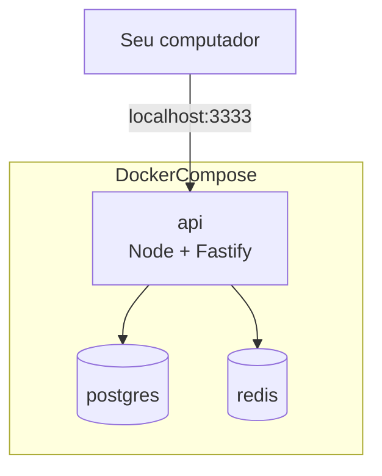

# TravelOps — Fase 1 (Guia Completo de Aprendizado)

Este guia documenta **tudo o que foi feito na Fase 1** do TravelOps e, principalmente, **por que** fizemos assim. A meta aqui não é “só rodar”, e sim entender a base técnica de um backend Node.js profissional.

> Objetivo da Fase 1 (do README): **criar base sólida do backend** com:
> - Fastify
> - TypeScript
> - ESLint
> - Prettier
> - tsup
> - dotenv
> - Docker / Docker Compose
> - Health Check `GET /health`

---

## 1) O que você deve ter ao final (Checklist de Entrega)

### 1.1. API rodando localmente (sem Docker)
- `npm install` funciona sem erros
- `npm run dev` sobe o servidor
- `GET /health` responde `200` com `{ "status": "ok" }`

### 1.2. Docker pronto (infra local para evoluir)
- `docker compose up --build` sobe:
  - `api`
  - `postgres`
  - `redis`

### 1.3. Qualidade mínima e projeto organizado
- TypeScript configurado e reconhecendo Node (`process`, etc.)
- Lint/format configurados (ESLint + Prettier)
- `.gitignore` impedindo `node_modules/` e `dist/` no Git
- `.dockerignore` evitando build lento e imagem gigante

---

## 2) Pré-requisitos (Ambiente)

### 2.1. O mínimo para seguir este guia
- Node.js **20+**
- npm **10+**
- Git
- Docker Desktop (para a parte do Docker/Compose)

### 2.2. Por que Node 20?
- Node 20 é base sólida para empresas
- suporte estável, recursos modernos de JS, e bom ecossistema

---

## 3) Visão Geral do “porquê” da arquitetura da Fase 1

A Fase 1 não é “arquitetura completa”, mas prepara o projeto para escalar.

### 3.1. Separação entre `app` e `server`
- `src/main/app.ts` cria a aplicação (rotas, plugins)
- `src/main/server.ts` é o entrypoint que:
  - carrega variáveis de ambiente (`dotenv`)
  - inicia o servidor (`listen`)

Isso ajuda MUITO nos testes e na organização:
- você pode testar `buildApp()` sem subir um servidor real
- você controla melhor inicialização e configuração

### 3.2. “Monólito modular” começa por plugin/rotas
Fastify brilha no formato “módulos via register”.
Hoje temos um módulo mínimo: `health`.

Depois, na Fase 2+, você cria módulos como:
- `modules/auth`
- `modules/vendors`
- etc.

---

## 4) Estrutura de Pastas (Fase 1)

Estrutura esperada:

```txt
c:\Servidor\sandbox\travelops\
├─ src\
│  ├─ config\
│  │  └─ env.ts
│  └─ main\
│     ├─ routes\
│     │  └─ health.ts
│     ├─ app.ts
│     └─ server.ts
├─ Dockerfile
├─ docker-compose.yml
├─ eslint.config.mjs
├─ package.json
├─ package-lock.json
├─ tsconfig.json
├─ tsup.config.ts
├─ .dockerignore
├─ .gitignore
└─ .prettierrc.json
```

---

## 5) Arquivos e responsabilidades (um por um)

A ideia aqui é você olhar cada arquivo e entender: “qual problema ele resolve?”.

### 5.1. `c:\Servidor\sandbox\travelops\package.json`
Responsabilidade:
- declarar dependências do runtime (`dependencies`)
- declarar ferramentas de dev (`devDependencies`)
- declarar scripts padronizados (`dev`, `build`, `start`, `lint`, `format`)

Pontos importantes:
- `dev`: `tsx watch` para desenvolvimento rápido (sem build manual)
- `build`: `tsup` gera `dist/` (produção)
- `start`: roda JS já compilado (sem TS em runtime)

Conceito Node aprendido:
- **scripts** viram “comandos oficiais” do projeto
- padroniza o jeito do time rodar, buildar, testar

### 5.2. `c:\Servidor\sandbox\travelops\tsconfig.json`
Responsabilidade:
- dizer para o TypeScript como analisar o código

Decisões:
- `rootDir: "src"` e `include: ["src/**/*.ts"]`: só o que está em `src/` é “código do app”
- `outDir: "dist"`: saída do build
- `types: ["node"]`: faz o TS reconhecer `process`, `Buffer`, etc.

Conceito Node/TS aprendido:
- TypeScript não “sabe” Node automaticamente
- você precisa de **type definitions** do Node (`@types/node`) e/ou configurar `types`

### 5.3. `c:\Servidor\sandbox\travelops\eslint.config.mjs`
Responsabilidade:
- regras de qualidade e consistência no código

Conceitos aprendidos:
- lint pega erro cedo (ex.: variável não usada)
- lint é “contrato de estilo” do time

### 5.4. `c:\Servidor\sandbox\travelops\.prettierrc.json`
Responsabilidade:
- formatação consistente (sem discussões de estilo)

Conceitos:
- Prettier evita “briga de espaços”
- você foca no conteúdo, não no formato

### 5.5. `c:\Servidor\sandbox\travelops\tsup.config.ts`
Responsabilidade:
- build rápido e simples (gera `dist/`)

Conceitos:
- build = transformar TS em JS para rodar em produção
- `tsx` serve para dev; `tsup` serve para build

### 5.6. `c:\Servidor\sandbox\travelops\src\config\env.ts`
Responsabilidade:
- centralizar e validar configurações vindas do ambiente
- garantir que a aplicação **falhe cedo** se config estiver errada

O que aprendemos aqui:
- `process.env.*` sempre retorna `string | undefined`
- porta precisa ser número inteiro válido
- host não pode ser string vazia

Por que validar no boot?
- se algo está errado, é melhor falhar ao iniciar do que falhar no meio de uma request em produção

### 5.7. `c:\Servidor\sandbox\travelops\src\main\routes\health.ts`
Responsabilidade:
- expor rota `GET /health`

Por que health check importa?
- em produção, load balancer/orquestrador (k8s, ECS etc.) precisa testar se sua app está viva
- em CI/CD, smoke tests podem bater em `/health`
- em Docker Compose, você pode evoluir para healthchecks

### 5.8. `c:\Servidor\sandbox\travelops\src\main\app.ts`
Responsabilidade:
- construir o Fastify e registrar rotas/plugins

Conceitos Fastify:
- `Fastify({ logger: true })`: logs estruturados desde o início
- `app.register(...)`: forma modular de acoplar recursos

### 5.9. `c:\Servidor\sandbox\travelops\src\main\server.ts`
Responsabilidade:
- entrypoint
- carrega `.env` via `dotenv/config`
- chama `listen` com `HOST`/`PORT`

Conceito Node:
- `main()` assíncrona e `await app.listen(...)`
- inicialização organizada e previsível

### 5.10. `c:\Servidor\sandbox\travelops\docker-compose.yml`
Responsabilidade:
- levantar infraestrutura local com um comando:
  - API
  - Postgres
  - Redis

Conceitos Docker/Compose:
- `depends_on` só controla ordem de start, não garante “pronto”
- volumes persistem dados do Postgres (`pgdata`)

### 5.11. `c:\Servidor\sandbox\travelops\Dockerfile`
Responsabilidade:
- criar a imagem da API

Fluxo padrão:
- copiar `package.json` + lock para cache eficiente
- `npm ci` (instala exato do lockfile)
- copiar código
- `npm run build`
- `npm start`

Conceitos:
- build dentro da imagem garante reprodutibilidade
- lockfile garante versões idênticas

### 5.12. `c:\Servidor\sandbox\travelops\.dockerignore`
Responsabilidade:
- não mandar lixo para o build context

Por que isso importa?
- build mais rápido
- imagem menor
- menos chance de vazar coisa desnecessária

### 5.13. `c:\Servidor\sandbox\travelops\.gitignore`
Responsabilidade:
- evitar commitar dependências e builds

Pontos-chave:
- `node_modules/` nunca vai pro Git
- `dist/` geralmente não vai pro Git (build é reprodutível)

---

## 6) Como rodar e validar (passo a passo)

### 6.1. Local (sem Docker)
Na raiz `c:\Servidor\sandbox\travelops`:

```powershell
npm install
npm run dev
```

Validar health:

```powershell
Invoke-RestMethod http://127.0.0.1:3333/health
```

Esperado:

```txt
status
------
ok
```

### 6.2. Docker (com infra)
Subir tudo:

```powershell
docker compose up --build
```

Validar health (mesmo comando):

```powershell
Invoke-RestMethod http://127.0.0.1:3333/health
```

---

## 7) Erros comuns (e o que você aprendeu resolvendo)

### 7.1. `ERESOLVE unable to resolve dependency tree`
Causa típica:
- alguma lib pede uma faixa de versão de TypeScript (peer dependency)
- seu TS está fora do range

Aprendizado:
- peer dependency é “contrato” entre bibliotecas
- npm v10 é mais rígido (isso é bom para consistência)

### 7.2. `Cannot find name 'process'`
Causa:
- TypeScript não está carregando tipos do Node

Correção padrão:
- instalar `@types/node`
- configurar `"types": ["node"]` no tsconfig

Aprendizado:
- TS precisa de “modelos de tipos” do runtime

### 7.3. “No inputs were found in config file”
Causa:
- `src/` estava vazio; não tinha `.ts` dentro do include

Aprendizado:
- `include` é um filtro real de arquivos analisados

---

## 8) Como pensar como um backend “sênior” nessa fase

### 8.1. Você não está “fazendo health check”
Você está estabelecendo:
- padrões de projeto (scripts, build, lint, format)
- base para modularização (Fastify register)
- base para infra local (Postgres/Redis)
- base para configuração segura (env.ts)

Isso é o tipo de coisa que separa “projeto que roda hoje” de “projeto que aguenta crescer”.

---

## 9) Exercícios (para aprender de verdade)

Faça estes desafios pequenos para consolidar:

### Exercício A — Status e tempo
- Modifique a rota `/health` para retornar:
  - `status: "ok"`
  - `timestamp` em ISO string

### Exercício B — PORT custom
- Rode com `PORT=4000` e confirme que `/health` responde na nova porta

### Exercício C — Erro controlado
- Force `HOST="   "` e observe o erro
- Explique com suas palavras por que “falhar cedo” é desejável

---

## 10) Próxima etapa (Fase 2 — Autenticação)

Quando você iniciar a Fase 2, seu projeto já está pronto para:
- conectar no Postgres via Prisma
- usar Redis
- adicionar rotas por módulo (`app.register(authModule)`)
- adicionar validação e autenticação via hook/plugin Fastify

Endpoints planejados (do README):
- `POST /auth/register`
- `POST /auth/login`
- `GET /me`

Ferramentas:
- JWT
- bcrypt

---

## 11) Diagramas (visuais)

### 11.1. Fluxo de request no Fastify (alto nível)

```mermaid
flowchart LR
  A[Cliente] -->|HTTP GET /health| B[Fastify Router]
  B --> C[Handler /health]
  C --> D[Response JSON {status: ok}]
  D --> A
```

### 11.2. Containers no Compose (Fase 1)



---

## 12) Conclusão

Se você chegou até aqui com `/health` funcionando e com Docker pronto, você concluiu a fase mais importante para projetos de backend: **a base**.

Próximo passo recomendado:
- commitar a Fase 1 com uma mensagem clara
- iniciar Fase 2 (auth) com o mesmo padrão: pequeno, validável, aprendível

